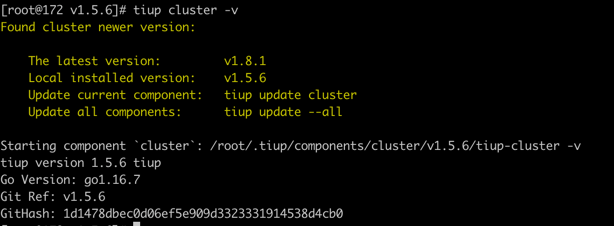

# demo 操作步骤

## 前置条件
1. 确保 [tiup](https://docs.pingcap.com/zh/tidb/stable/production-deployment-using-tiup/) 已经安装
2. go version >= 1.16

## 操作步骤
#### 1. 下载代码
    git clone https://github.com/hackathon2021-pCloud/pCloud 

#### 2. 编译并替换 tiup cluster
    cd tiup
    make cluster
    cp bin/tiup-cluster {TiUP_CLUSTER_PATH}
其中 `{TiUP_CLUSTER_PATH}` 可以使用 `tiup cluster -v` 进行查看, 例如

#### 3. 通过 tiup 部署测试集群（可以参考 demo/hi.yml)
    tiup cluster deploy hi v5.3.0 hi.yml -y -p
    tiup cluster start hi

#### 4.1 为这个集群灌入测试数据
    tiup bench tpcc prepare --warehouses 10 --db tpcc --threads 8 -P 4001

### 注意
*使用上云功能和恢复功能, 需要 s3 权限, 可以通过环境变量的方式进行设置*

    export ACCESS_KEY={ACCESS_KEY}
    export SECRET_ACCESS_KEY={SECRET_ACCESS_KEY}

#### 4.2 为这个集群开启 PiTR 上云功能
    tiup cluster cloud hi backup
后续根据提示完成操作

#### 5. 部署另一个集群进行恢复验证（可以参考 demo/ho.yml)
    tiup cluster cloud ho v5.3.0 ho.yml -y -p
    tiup cluster start ho

#### 6. 停止写入(为了方便数据比对)

#### 7. 为新集群开启恢复
    tiup cluster cloud ho restore {TOKEN}
{TOKEN} 是备份时候生成的跟集群一一对应的字符串。

#### 8. 检查两套集群数据是否一致